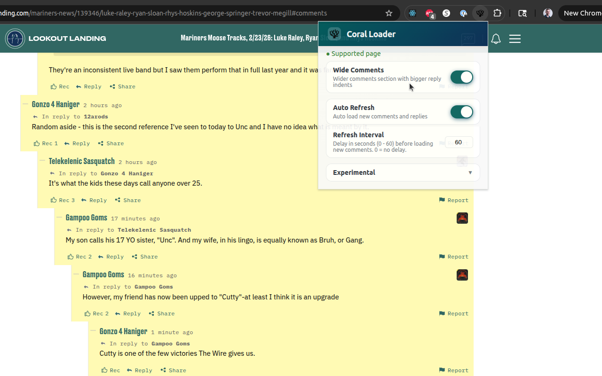

# coral-loader

 

A Chrome extension to improve the experience of Vox Media's Coral commenting system on SBNation sites.

Install from Chrome Web Store:
https://chrome.google.com/webstore/detail/coral-loader/fiomjcpnnmiapdalgaglkhlgmpmdanhh

## Features

- Wider comments section with larger reply indents
- Auto-load new comments and replies with a configurable refresh interval



## Development

### Prerequisites

- Node.js 18+
- npm 9+

### Installation

```bash
npm install
```

### Development

```bash
npm run dev
```

### Build

```bash
npm run build
```

### Load extension in Chrome

1. Open Chrome and navigate to `chrome://extensions`
2. Enable "Developer mode" in the top-right corner
3. Click "Load unpacked"
4. Run a build and then select the `dist` folder
